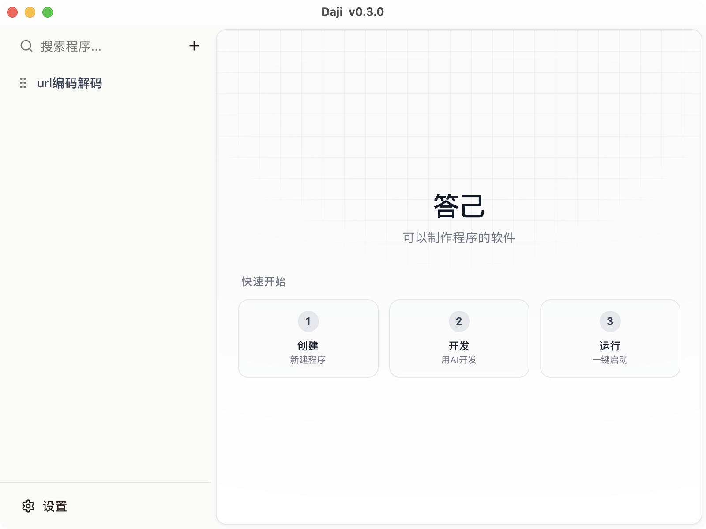

# Daji - 本地服务版本管理工具

<p align="center">
  
</p>

<p align="center">
  <strong>可以制作程序的软件</strong>
</p>

## 📸 应用截图



## 📖 简介

答己是一款 AI 驱动的桌面应用，让你轻松创建各种程序。只需用自然语言描述你的需求，AI 就能自动生成代码。所有程序都在安全的沙盒环境中运行，不会影响你的电脑。

## ✨ 核心功能

### 🤖 AI 驱动开发
- **自然语言编程**：只需描述需求，AI 自动生成代码
- **智能对话迭代**：与 AI 对话，不断完善和改进程序
- **自动错误修复**：AI 帮助调试和修复代码错误
- **多 AI 提供商**：支持 OpenAI、DeepSeek、阿里千问等多种 AI 服务

### 🛡️ 沙盒环境
- **安全隔离**：程序在独立的沙盒环境中运行
- **无惧恶意代码**：完全隔离，不影响电脑安全
- **实时日志**：查看程序运行输出和错误信息
- **进程管理**：轻松启动、停止和重启程序

### 🎨 简单易用
- **直观界面**：左侧程序列表，右侧预览区域
- **实时预览**：代码修改后即时看到运行效果
- **多标签视图**：在代码视图和预览视图之间自由切换
- **拖拽排序**：自由调整程序列表顺序
- **主题切换**：支持亮色/暗色模式

## 🛠️ 技术栈

- **前端框架**: React 18 + TypeScript + Vite
- **UI 组件库**: Radix UI + Tailwind CSS + shadcn/ui
- **桌面框架**: Tauri 2.0
- **状态管理**: Zustand
- **数据库**: SQLite (通过 Tauri 插件)
- **拖拽排序**: dnd-kit
- **图表**: Recharts
- **国际化**: i18next

## 📋 系统要求

- Node.js 18+
- Rust 1.70+
- pnpm (推荐使用)

### macOS
- macOS 10.15+

### Windows
- Windows 10+

### Linux
- 主流 Linux 发行版

## 🚀 快速开始

### 1. 克隆项目

```bash
git clone <repository-url>
cd daji-app
```

### 2. 安装依赖

```bash
pnpm install
```

### 3. 开发模式运行

```bash
pnpm dev:pc
```

### 4. 构建生产版本

```bash
pnpm pack
```

## 📦 可用脚本

| 命令 | 说明 |
|------|------|
| `pnpm dev` | 启动 Vite 开发服务器 |
| `pnpm dev:pc` | 启动 Tauri 开发模式（推荐） |
| `pnpm build` | 构建前端代码 |
| `pnpm pack` | 构建桌面应用程序 |
| `pnpm publish` | 发布新版本 |
| `pnpm preview` | 预览构建结果 |

## 🎯 使用流程

1. **创建程序**：点击「新建程序」，用自然语言描述你想要的功能
2. **AI 生成**：AI 理解需求并生成完整的可运行代码
3. **实时预览**：在预览窗口中即时看到程序运行效果
4. **对话优化**：通过与 AI 对话，不断迭代和完善程序
5. **保存使用**：将满意的程序保存到本地数据库，随时运行

## 💡 使用示例

你可以让 AI 帮你创建各种程序，例如：

- **「做一个番茄钟计时器」** → AI 生成一个可视化的倒计时应用
- **「做一个随机密码生成器」** → AI 创建密码生成工具
- **「做一个简单的计算器」** → AI 构建交互式计算器
- **「做一个待办事项列表」** → AI 开发任务管理应用
- **「做一个颜色选择器」** → AI 制作颜色拾取工具

## 🐛 问题反馈

如果你发现了 bug 或有新的功能建议，请在 [Issues](../../issues) 页面提交。

## 📄 许可证

本项目采用 MIT 许可证。详见 [LICENSE](LICENSE) 文件。

---
